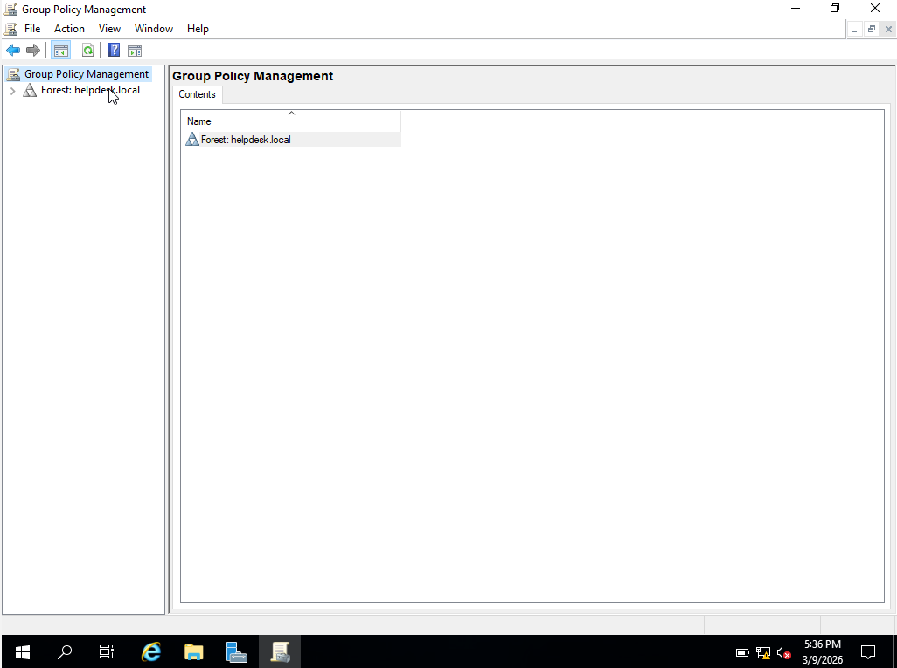
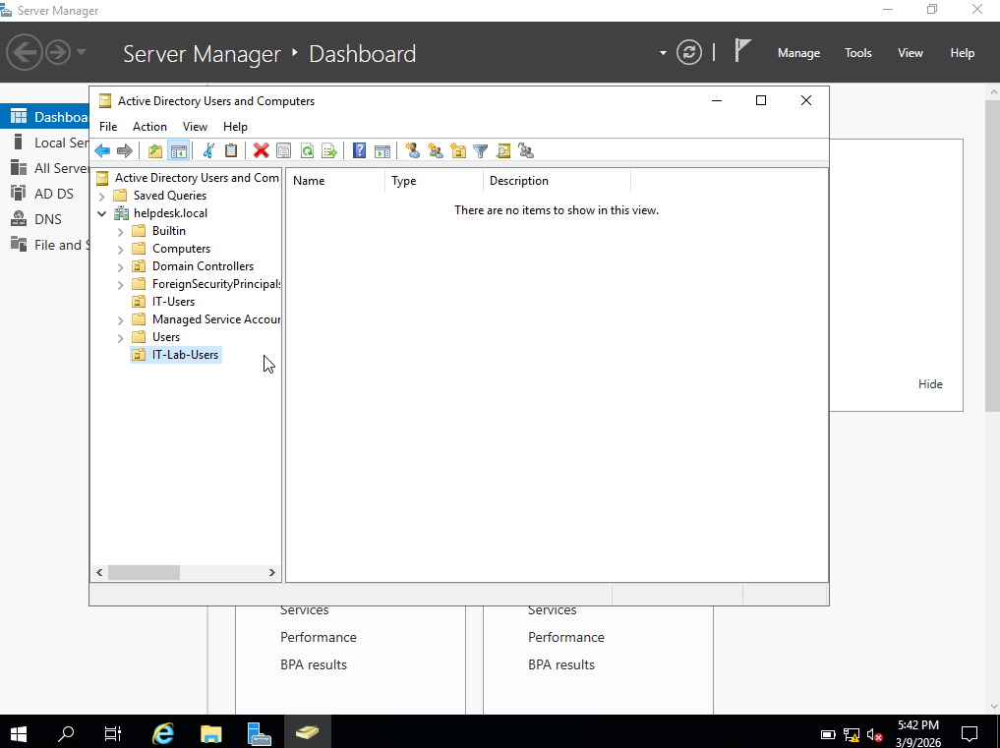
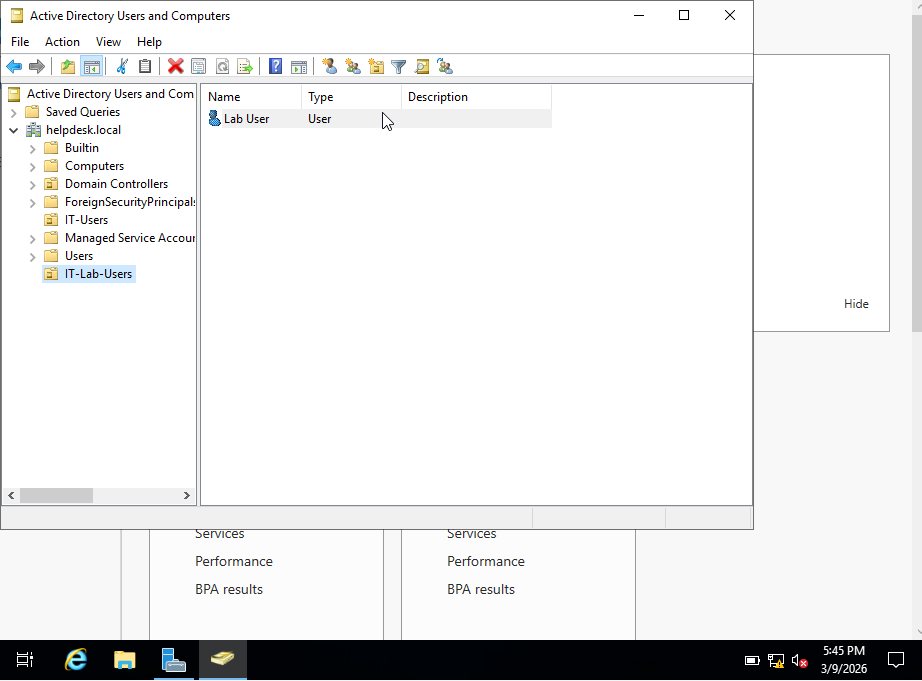
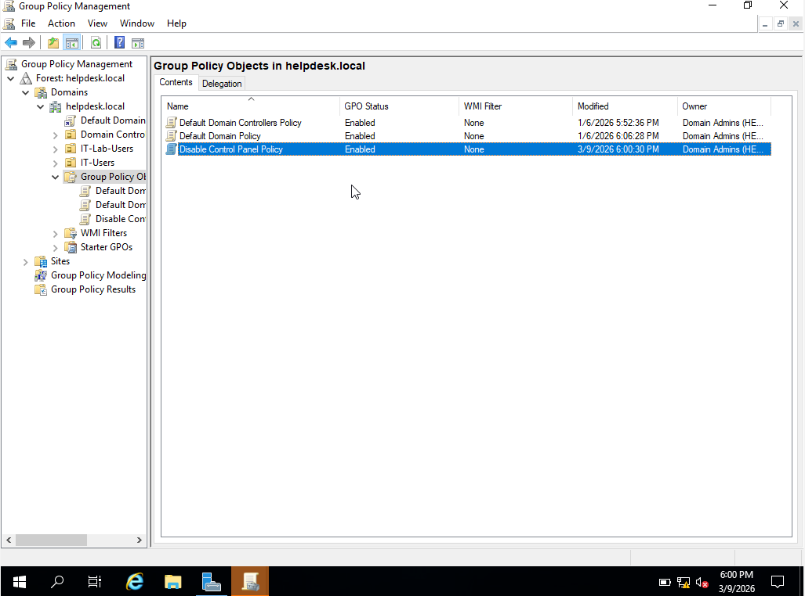
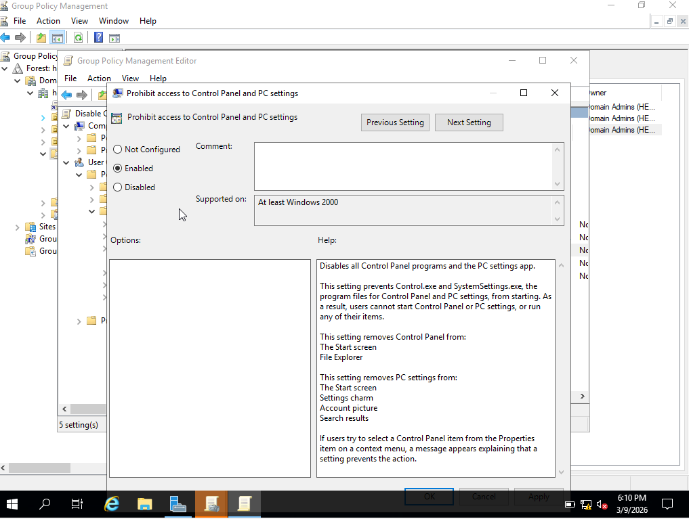
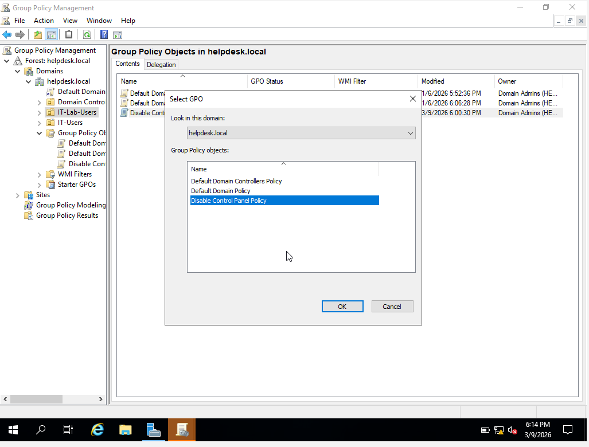
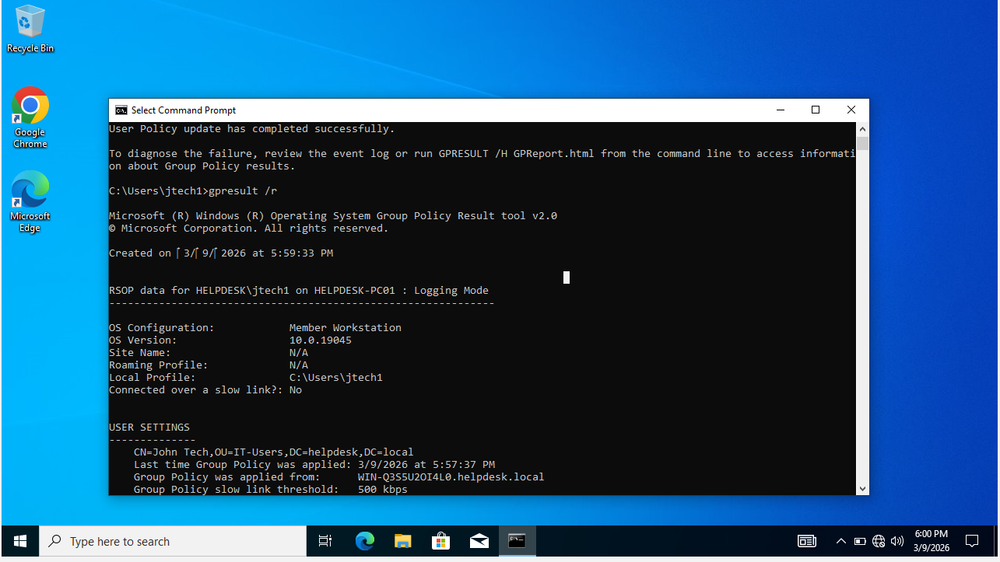
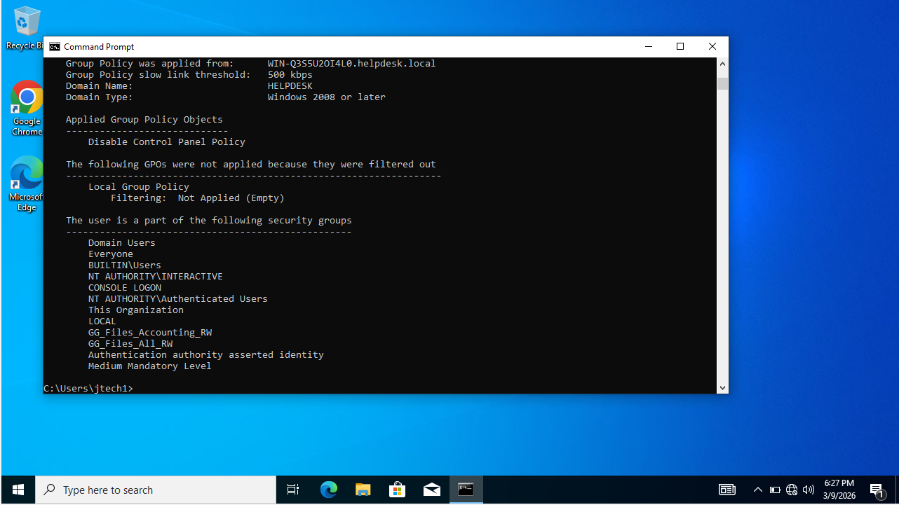
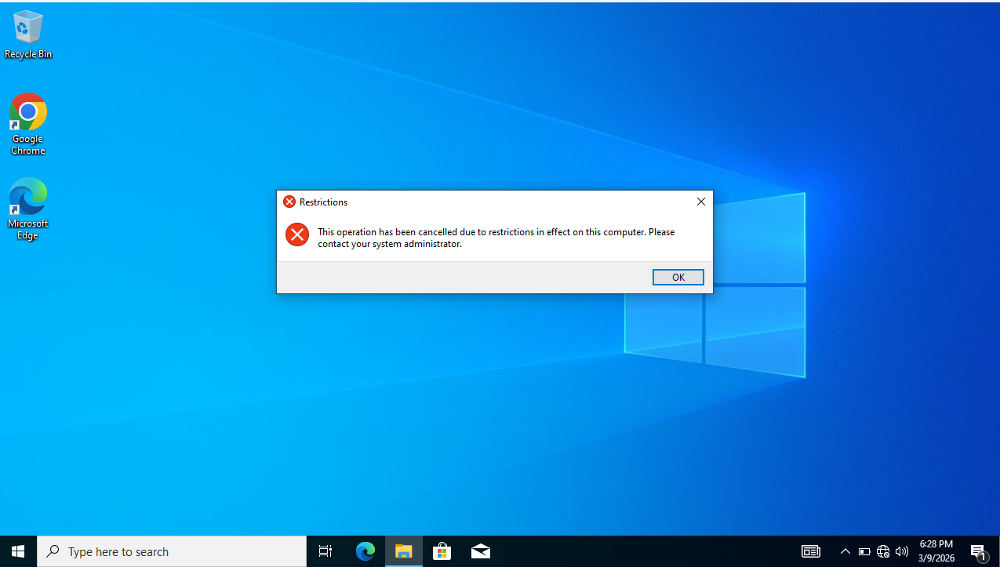

# Active Directory Group Policy Lab

## Objective
Demonstrate how to create and apply a Group Policy Object (GPO) in Active Directory to restrict user access to the Control Panel.

This lab simulates a common enterprise IT scenario where administrators restrict system settings for standard users.

---

## Lab Environment

- Windows Server (Domain Controller)
- Windows Client Machine
- Active Directory Domain: helpdesk.local
- Virtualization: VirtualBox

---

## Tasks Performed
## Lab Walkthrough

### Step 1 – Open Group Policy Management

### Step 2 – Create Organizational Unit

### Step 3 – Create Test User

### Step 4 – Create Group Policy Object

### Step 5 – Configure Control Panel Restriction

### Step 6 – Link GPO to OU

### Step 7 – Verify Policy with gpresult

### Step 8 – Confirm Policy Applied

### Step 9 – Control Panel Blocked

## Commands Used
gpupdate /force
gpresult /r

---

## Verification

The Group Policy Object was successfully applied to the user account.

The command below confirmed the applied policy:
gpresult /r
