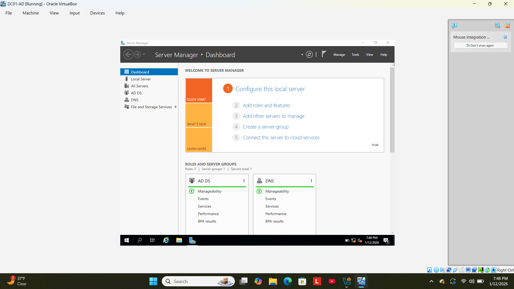
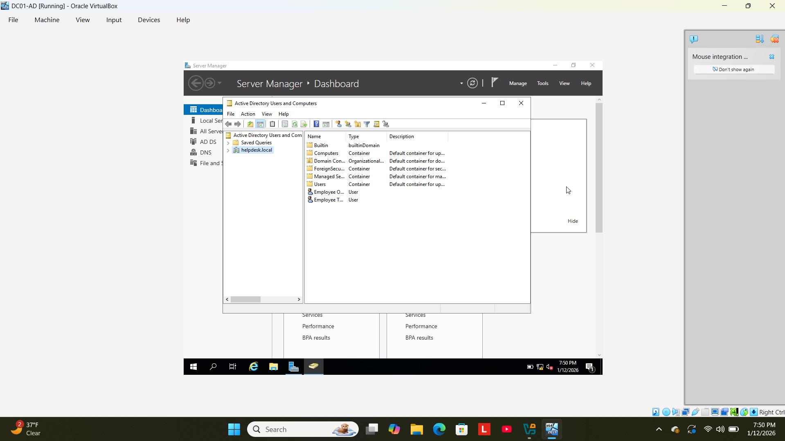
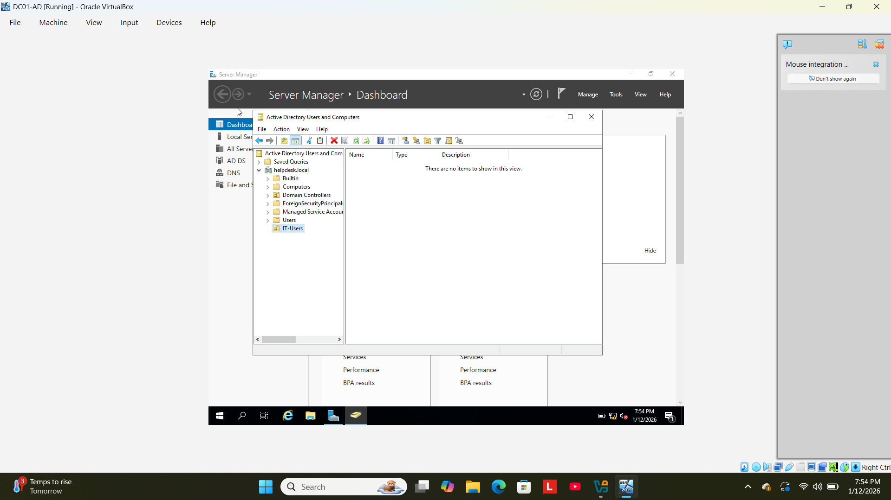
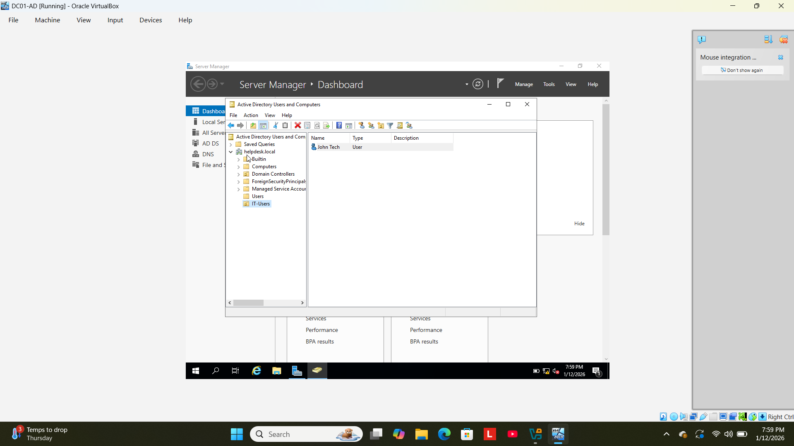
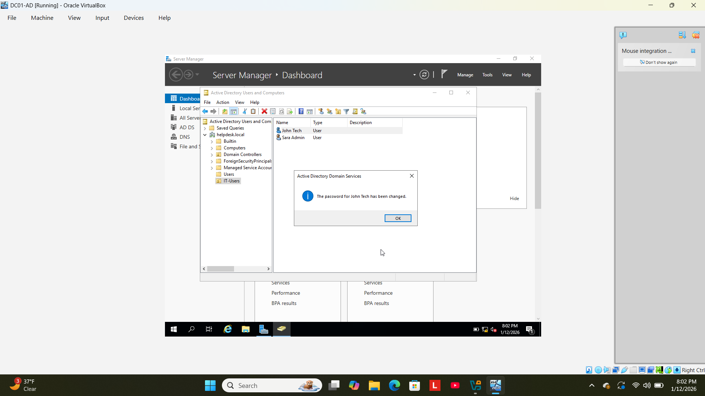
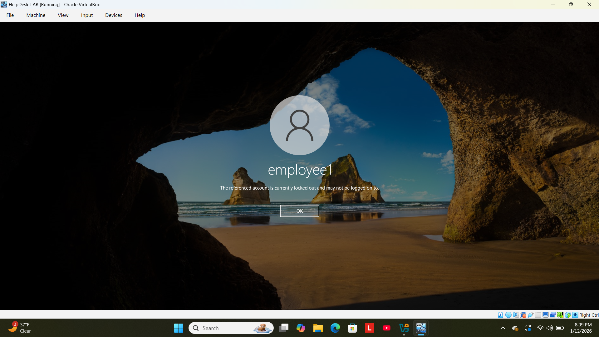
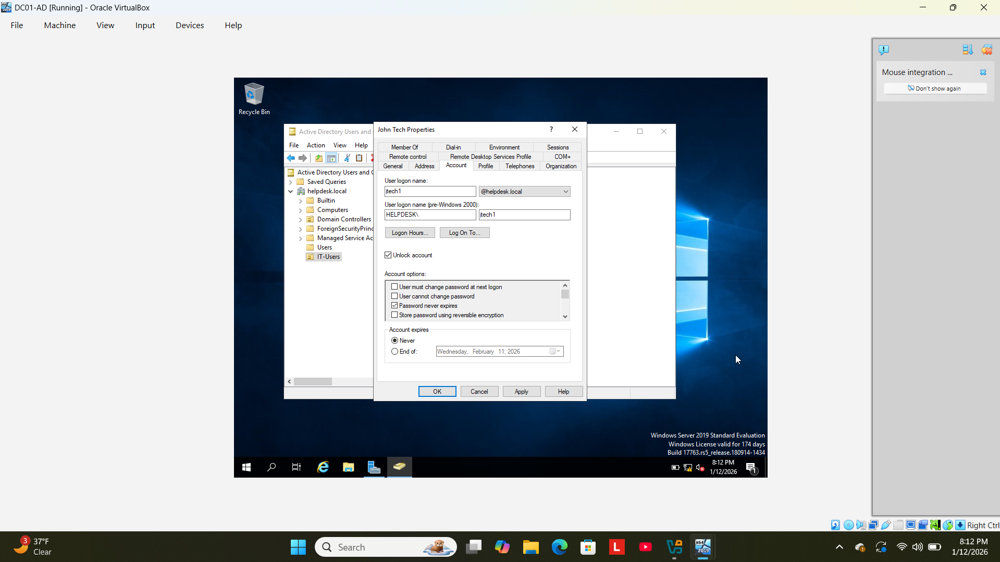

# Active Directory User Management Lab

## Objective
Simulate real-world help desk tasks using Active Directory including creating organizational units, managing users, resetting passwords, and unlocking accounts.

## Tools Used
- Oracle VirtualBox
- Windows Server 2019
- Windows 10
- Active Directory Users and Computers

## Lab Steps
1. Started domain controller (DC01-AD) and verified Server Manager.
2. Opened Active Directory Users and Computers.
3. Created Organizational Unit: IT-Users.
4. Created users: jtech and sadmin.
5. Reset password for user jtech.
6. Simulated account lockout using client VM.
7. Unlocked user account in Active Directory.

## Screenshots

### Server Manager Running

### Active Directory Open

### Organizational Unit Created

### User jtech Created

### User sadmin Created

### Password Reset

### Account Lockout

### Account Unlocked

## What I Learned
- How to manage users and OUs in Active Directory.
- How to reset passwords and unlock accounts.
- How domain authentication works in a lab environment.
- How to document technical work for a portfolio.
