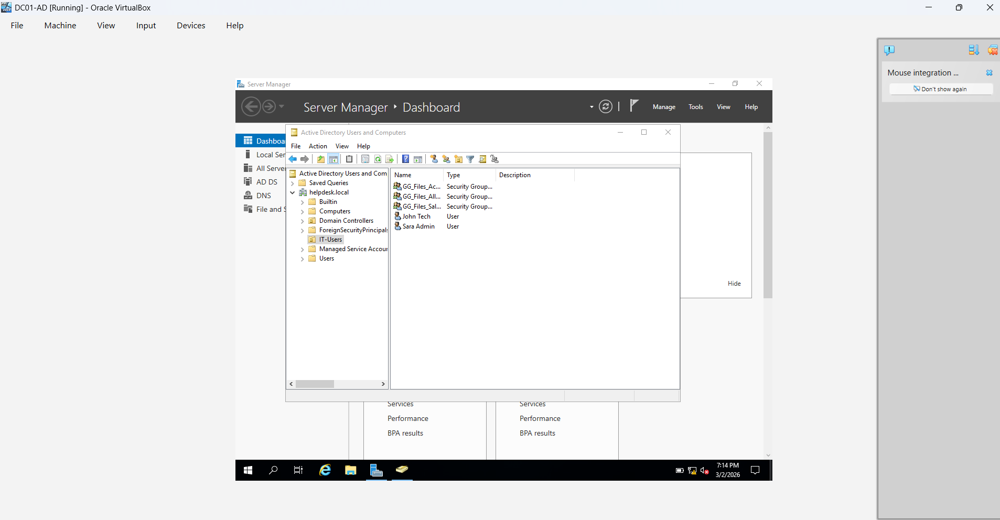
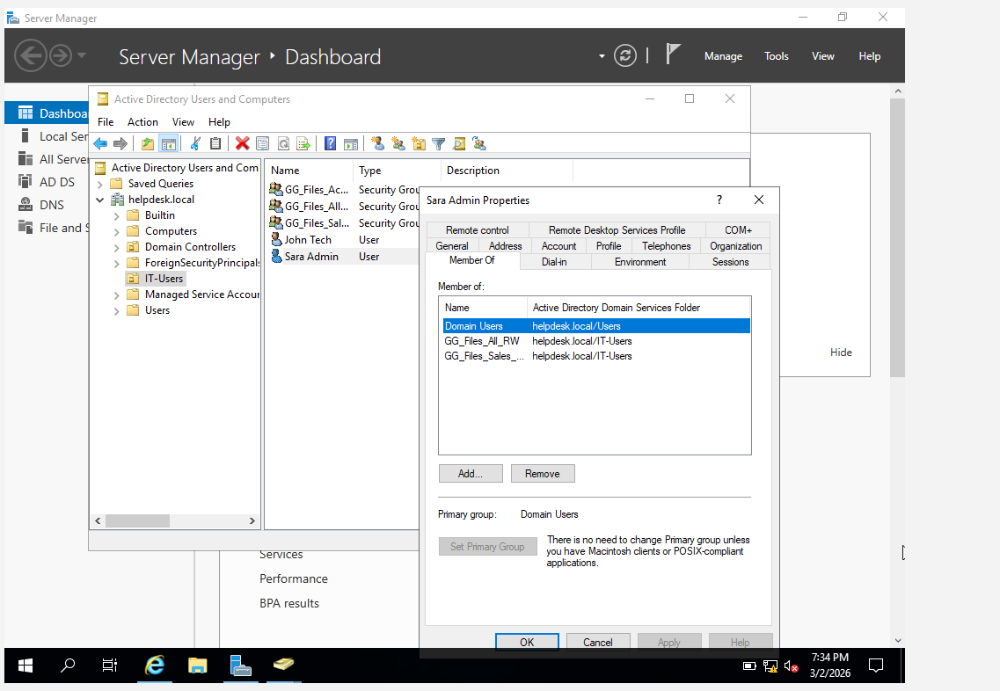
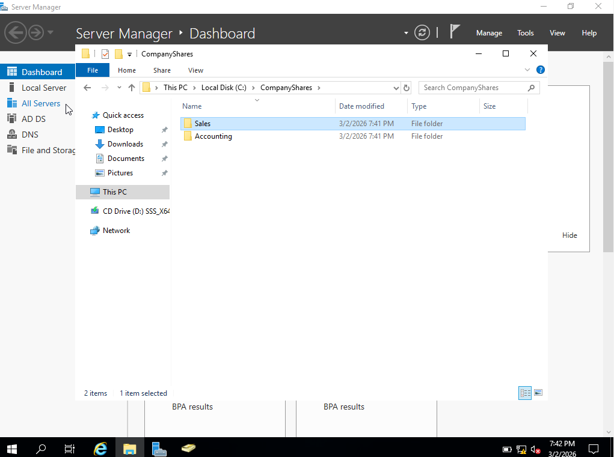
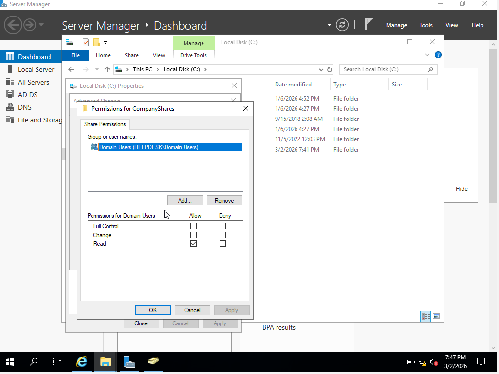
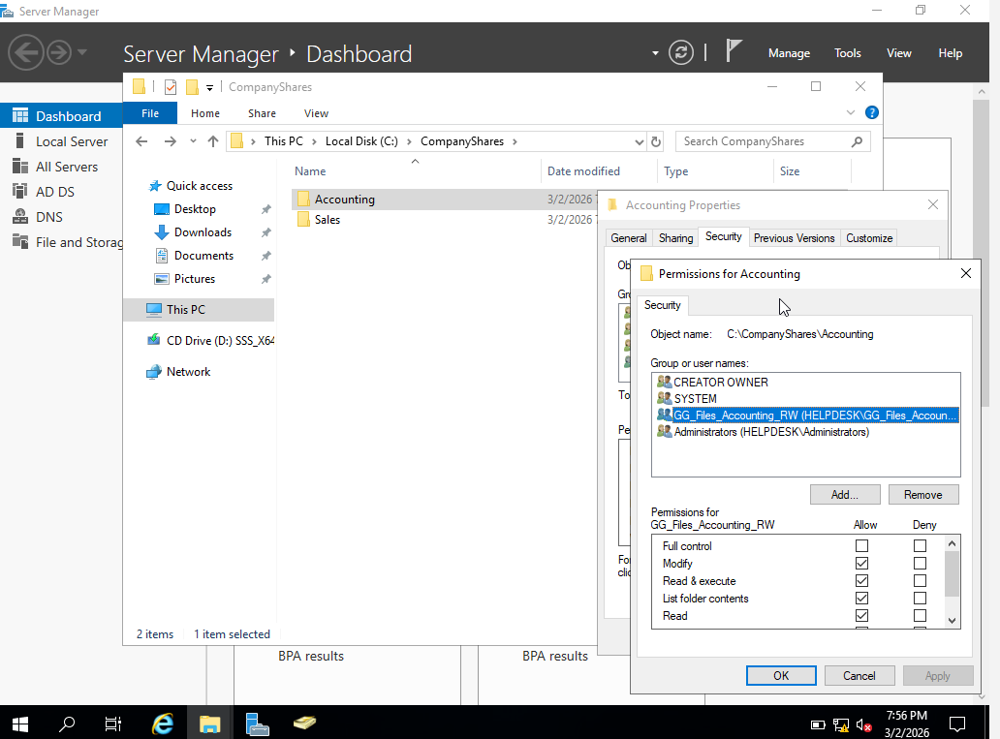
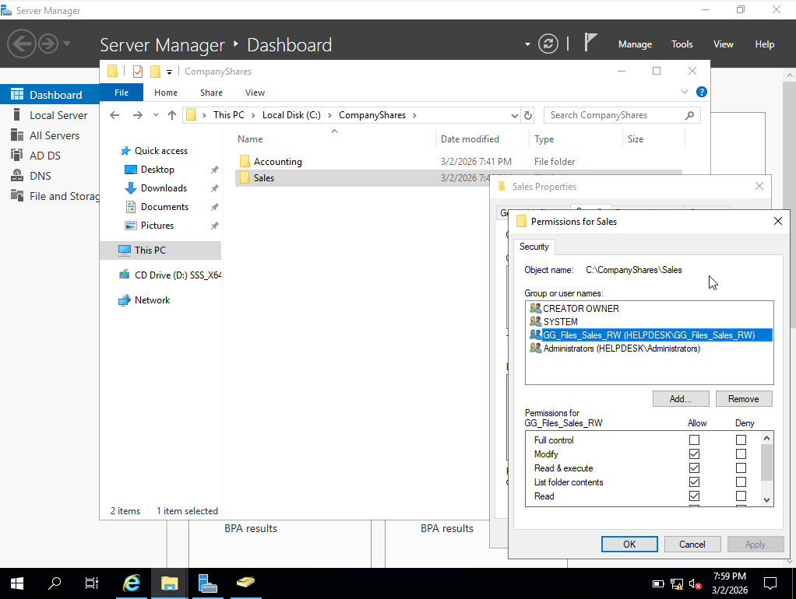
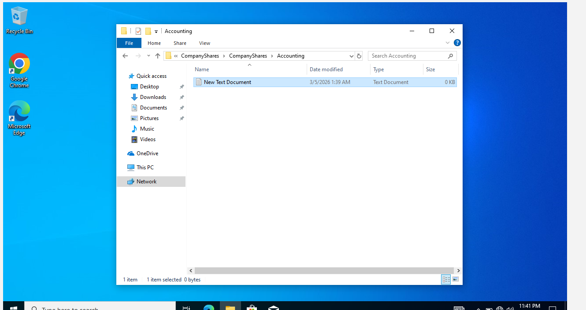

# Active Directory File Share Lab

## Overview

This lab demonstrates how to configure secure shared folders in a Windows Server Active Directory environment.
Security groups were used to manage user access and NTFS permissions were applied to control which departments could access specific folders.

## Technologies Used

* Windows Server
* Active Directory Domain Services
* NTFS Permissions
* Shared Folder Permissions
* Security Groups

---

# Lab Steps

## 1. Create Active Directory Security Groups

Security groups were created to control access to department folders.

Examples:

* GG_Files_Accounting_RW
* GG_Files_All_RW
* GG_Files_Sales_RW

These groups will later be assigned permissions to department folders.

---

## 2. Add Users to Security Groups

Users were added to the appropriate Active Directory groups so they could inherit permissions.

Example:

* Sara Admin added to department file access groups.

Using groups instead of individual permissions makes access easier to manage.

---

## 3. Create Department Shared Folders

A shared directory structure was created for company departments.

Folders created:

* Accounting
* Sales

These folders are stored inside the main company share folder.

---

## 4. Configure Share Permissions

Share permissions were configured on the CompanyShares directory so domain users could access the file server over the network.

Permissions granted:

* Domain Users → Read access

This allows users to reach the shared folder while NTFS permissions control detailed access.

---

## 5. Configure NTFS Permissions for Accounting

NTFS permissions were applied to the **Accounting folder**.

The Accounting security group was granted:

* Read
* Write
* Modify

This ensures only authorized accounting users can access and modify files.

---

## 6. Configure NTFS Permissions for Sales

NTFS permissions were configured for the **Sales folder** using the Sales security group.

Permissions granted:

* Read
* Write
* Modify

This ensures only Sales department users can access Sales files.

---

## 7. Test User Access

Access was verified by logging in as a domain user and successfully creating a file inside the Accounting folder.

This confirms the permissions were configured correctly.

---

# Key Concepts Demonstrated

* Active Directory group-based access control
* Share vs NTFS permissions
* Windows Server file sharing
* Department folder security design
* Access verification

---

# Skills Demonstrated

* Windows Server Administration
* Active Directory Management
* NTFS Permission Configuration
* File Share Security
* Troubleshooting User Access
